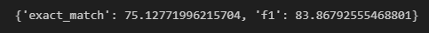
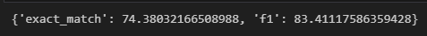
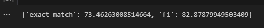
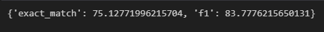
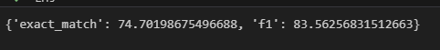
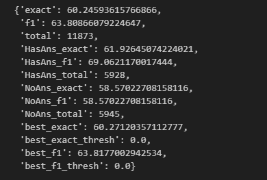
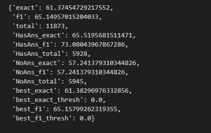
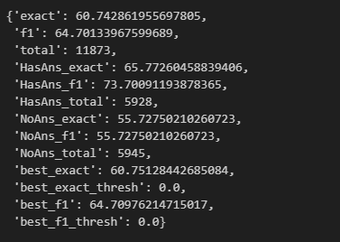

## 最早开始的时候不知道ipynb可以保存执行状态,因此只截了图....

### 1. 老师课程中的原始代码(多轮训练,即将第一轮的输出Model作为下一轮的输入Model)

#### 1.1 训练第一轮



#### 1.2 训练第二轮



#### 1.3 训练第三轮




### 2. 使用squad v1 修改原始训练参数,主要修改


```
learning_rate=3e-5,
weight_decay=0.0001,

```

#### 2.1 训练第一轮:



#### 2.2 训练第二轮




### 3. 使用squad v2 


#### 3.1 训练第一轮:



#### 3.2 训练第二轮




#### 3.3 训练第三轮

