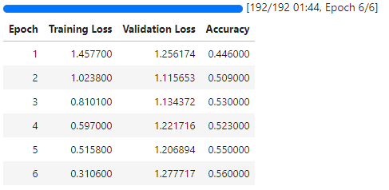
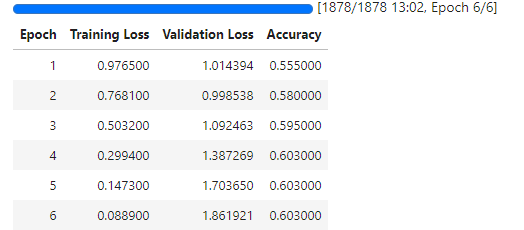
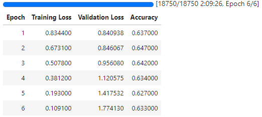
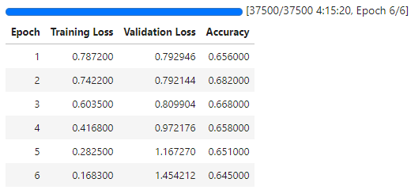
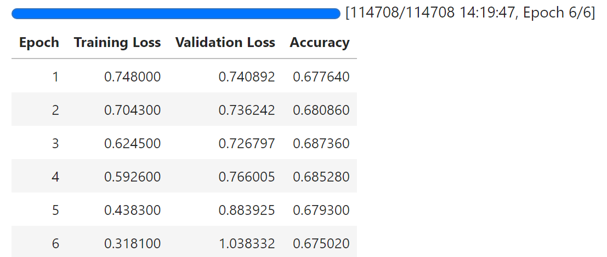
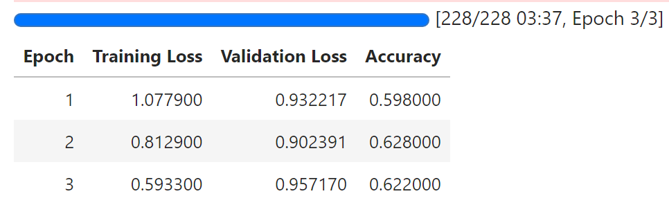
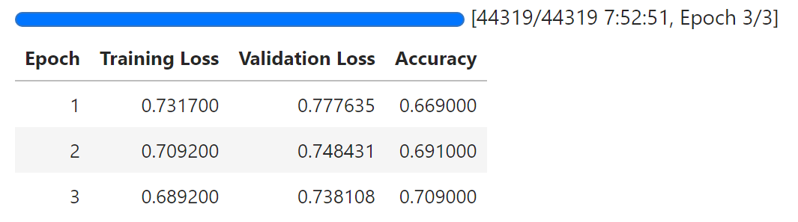

## 最早开始的时候不知道ipynb可以保存执行状态,因此只截了图....

### 1. 使用bert-base-cased模型,YelpReviewFull数据集,各个训练参数训练结果如下：

#### 1.1 1k训练数据,1k验证数据,6epochs

#### 1.2 10k训练数据,1k验证数据,6epochs

#### 1.3 100k训练数据,1k验证数据,6epochs

#### 1.4 200k训练数据,1k验证数据,6epochs

#### 1.5 all训练数据,all验证数据,6epochs

### 2. 使用bert-large-cased模型,YelpReviewFull数据集,各个训练参数训练结果如下：

#### 1.1 10k训练数据,1k验证数据,3epochs

#### 1.2 all训练数据,1k验证数据,3epochs

